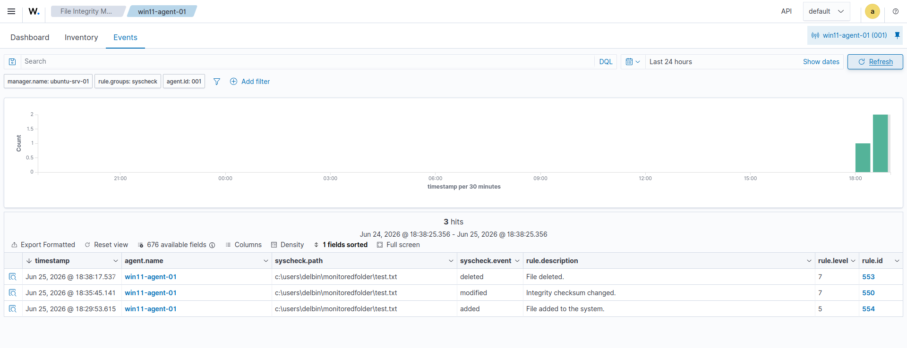
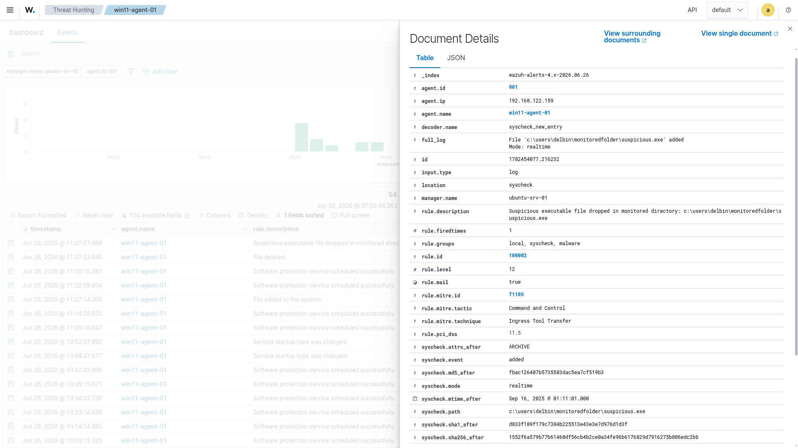
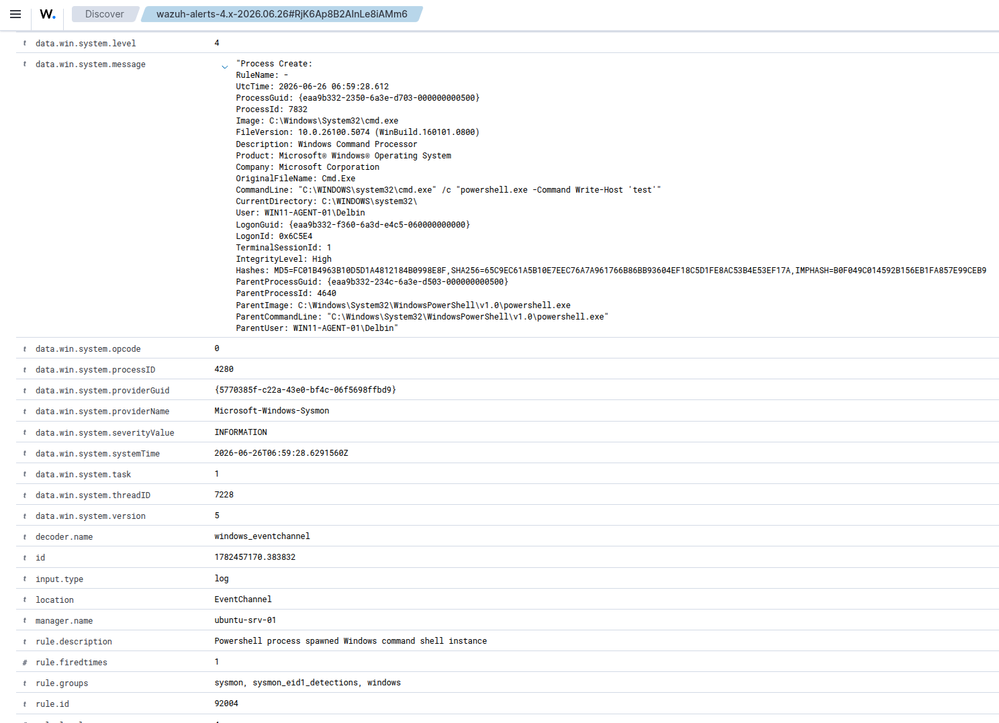
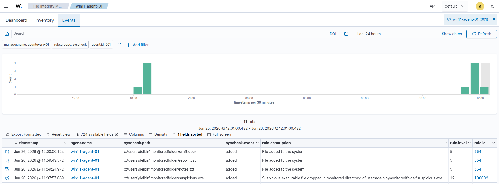
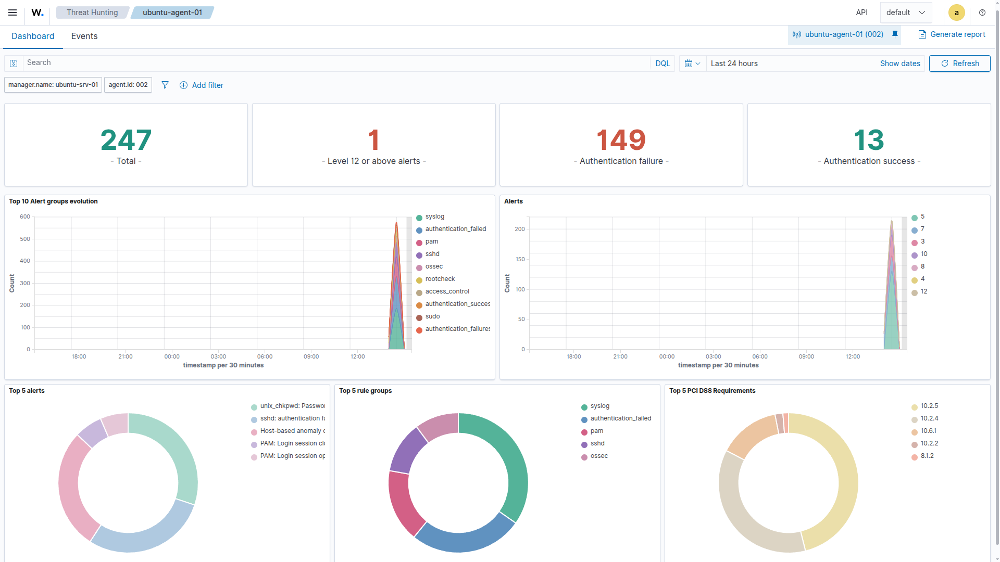
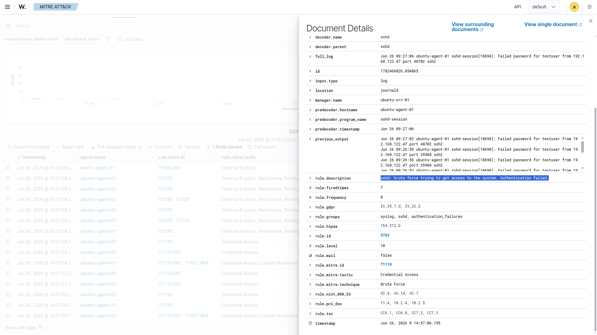
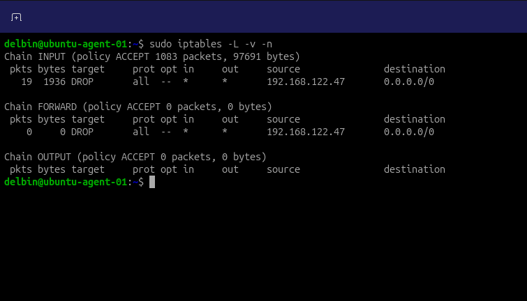

# Wazuh SIEM Home Lab - SOC Detection & Response

## What this demonstrates

- A multi-OS SIEM deployment monitoring Windows and Linux endpoints from one dashboard
- Real-time file integrity monitoring (FIM) on both Windows and Linux, normalized into one alert format
- A custom detection rule, written from scratch and mapped to MITRE ATT&CK, not pulled from Wazuh's default ruleset
- Sysmon added for process-level visibility that default Windows logs don't provide
- Three documented cases of telling a false positive apart from a real threat, including one I didn't expect
- A real SSH brute-force attack, detected and stopped automatically with no manual intervention

---

## Architecture

| Component | Role |
|---|---|
| Ubuntu Server | Wazuh Manager, Indexer, and Dashboard, all-in-one |
| Windows 11 Enterprise | Monitored endpoint. FIM and Sysmon telemetry |
| Ubuntu Server | Monitored endpoint. FIM and the SSH brute-force target |
| Kali Linux | Attack simulation with Hydra |

Everything runs on an isolated NAT network. It's deliberately not exposed to my home LAN, since part of this lab involves weakened credentials on purpose.

## Stack

Wazuh 4.14.5, Ubuntu Server 26.04, Windows 11 Enterprise, Sysmon, Hydra, QEMU/KVM

---

## 1. File Integrity Monitoring

I set up real-time FIM on both the Windows and Linux endpoints, watching a folder on each for file creation, modification, and deletion.



Windows and Linux handle this differently under the hood. Windows uses its native file-change notification system, Linux uses inotify. Wazuh normalizes both into the same alert format, which is really the point of running a SIEM in the first place: one place to look, regardless of what's generating the data underneath.

## 2. A Custom Detection Rule

Default FIM treats every file change the same way, which isn't enough on its own. I wrote a rule that escalates specifically when a `.exe` file lands in the monitored folder, a realistic pattern for malware being dropped onto a system.

```xml
<group name="local,syscheck,">
  <rule id="100002" level="12">
    <if_sid>554</if_sid>
    <field name="file" type="pcre2">\.exe$</field>
    <description>Suspicious executable file dropped in monitored directory</description>
    <mitre><id>T1105</id></mitre>
    <group>malware,pci_dss_11.5,</group>
  </rule>
</group>
```



It's mapped to MITRE T1105 (Ingress Tool Transfer) and tagged against PCI-DSS 11.5, the file integrity monitoring requirement.

## 3. Sysmon for Process Visibility

I added Sysmon to the Windows agent, using the SwiftOnSecurity config, to get parent-child process relationships that Windows doesn't log by default.



I triggered a PowerShell-to-cmd.exe chain and captured the full lineage, including the command line and the parent process. That kind of chain is exactly what shows up when a script or macro launches something it shouldn't.

## 4. Telling Signal From Noise

Generating an alert is easy. Knowing whether it matters is the actual job, so I tested both sides of it.



Three ordinary files, a `.txt`, a `.csv`, and a `.docx`, all triggered the standard low-severity FIM alert. The `.exe` test from section 2 triggered the high-severity custom rule. Same pipeline, correctly different outcomes.

A more interesting case showed up on its own, unstaged: a high-severity Sysmon alert tagged with the same T1105 technique as my custom rule. I checked the raw event rather than assuming it was real, and traced it to PowerShell's own internal script-policy self-test file, a benign mechanism that happened to match a "executable written to a temp folder" pattern. A rule firing means something matched a pattern. It doesn't mean something bad happened, and someone still has to check.

## 5. Simulating an SSH Brute-Force Attack

From Kali, I used Hydra to brute-force SSH on the Ubuntu agent, targeting a test account with a deliberately weak password rather than a real one, to keep the test contained to something disposable.



Wazuh picked up the pattern and escalated through several rule levels as the attempts continued, logging 149 authentication failures against 13 successful logins in that window. The gap between those two numbers is the actual signal a SOC analyst would be looking at, not the raw alert count.



It's mapped to MITRE T1110 (Brute Force) under the Credential Access tactic, and the alerts came pre-tagged against PCI-DSS, HIPAA, NIST 800-53, and GDPR logging requirements, without any extra work on my part.

## 6. Automated Response

I configured Active Response so that once Wazuh's brute-force rule fired, it would automatically block the attacking IP for 10 minutes rather than indefinitely.



I confirmed the full cycle worked as intended: the block engaged, lifted automatically once the timeout passed, and re-engaged when the attack continued. The short timeout was a deliberate choice to avoid locking out a legitimate user over one bad login, but it's also a real limitation as configured here. A determined attacker can simply wait out the 10 minutes and resume. In production, I'd pair this with escalating block durations for repeat offenders on the same IP, rather than relying on a single flat timeout.

---

## What I'd Do Differently in Production

- Password authentication and a disabled-by-default account were intentionally left weakened to make the attack demonstrable. In a real deployment, key-based SSH and disabled default accounts would be standard.
- Active Response here blocks by IP address. At scale, I'd pair this with proper account lockout policy and a SOAR layer for triage, rather than relying on IP blocking alone.

---

## Repo Contents

- `rules/local_rules.xml` — the custom detection rule from section 2
- `configs/` — the relevant FIM config snippets for both Windows and Linux agents
- `screenshots/` — the evidence referenced throughout this README

## Contact

[LinkedIn](https://www.linkedin.com/in/delbinjoseph/) · [Portfolio](https://delbinjoseph.com/) · [hello@delbinjoseph.com](mailto:hello@delbinjoseph.com)

---

*This lab was built in an isolated, offline environment for educational purposes. Configurations shown intentionally weaken default security controls to demonstrate detection capabilities and should not be replicated outside a controlled lab.*
